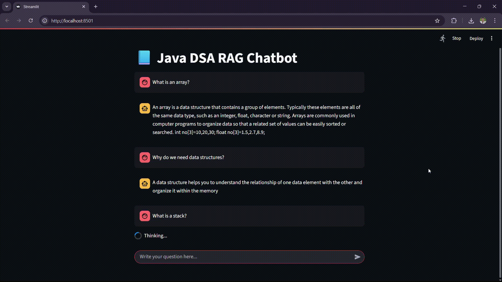

# 🤖 Java DSA Retrival-Augumented Generation (RAG) Chatbot

This is a Java DSA (Data Structures and Algorithms) `RAG` (Retrieval-Augmented Generation) Chatbot built using `Streamlit` for the frontend and `LangChain` with HuggingFace models for the backend.

---

## 🧠 Technology Stack

-   `Streamlit`: For building the interactive chat interface.
-   `LangChain`: To handle document loading, splitting, embeddings, retrieval, and chaining.
-   `FAISS`: For fast vector similarity search.
-   `Transformers` (HuggingFace): To use the T5 model for text generation.
-   `PDF file`: Acts as the knowledge base.

---

## 🤷🏻 What it does?

-   The chatbot can answer questions related to DSA topics based on a PDF file (dsa_notes.pdf) provided in the **data** folder.
-   It uses a Retrieval-Augmented Generation (RAG) approach: the bot searches for relevant context from the PDF and then generates an answer using a language model.

---

## 📽️ Demo of the chat application



---

## ⚙️ How it works?

1. _PDF Loader_: The `PyPDFLoader` loads and extracts text from **dsa_notes.pdf**.
2. _Text Splitting_: The text is split into manageable chunks using `RecursiveCharacterTextSplitter` so that the model can process them efficiently.
3. _Embedding_: Each chunk is converted into vector form using `sentence-transformers/all-MiniLM-L6-v2` embeddings.
4. _Vector Store_: These vectors are stored in a `FAISS` index for fast similarity search.
5. _Model_: The Q&A is powered by **google/flan-t5-small** using `HuggingFace` Transformers. It uses the retrieved context to generate relevant answers.
6. _UI_: A Streamlit-based interface provides a chat-style experience for asking questions.

---

## 🏃🏻‍♂️ How to run:

1. Install the required Python libraries.

```bash
pip install -r requirements.txt
```

2. Run the app using:

```bash
streamlit run app.py
```

3. Ask any Java DSA-related question in the chat input box and get contextual answers based on the PDF.

> You can add your own pdf notes to get answers for any specific domains you want.
